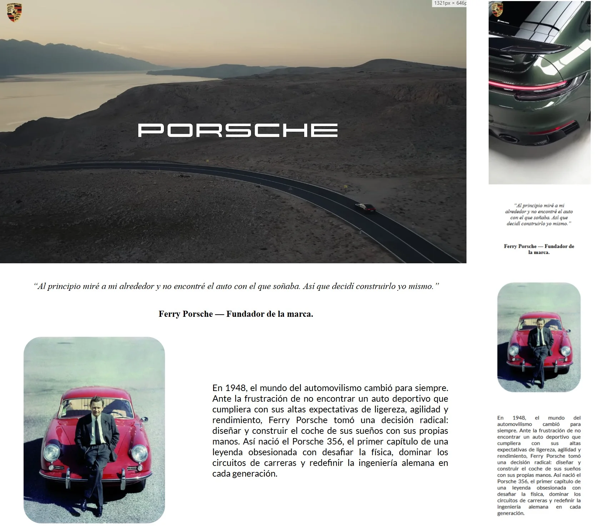
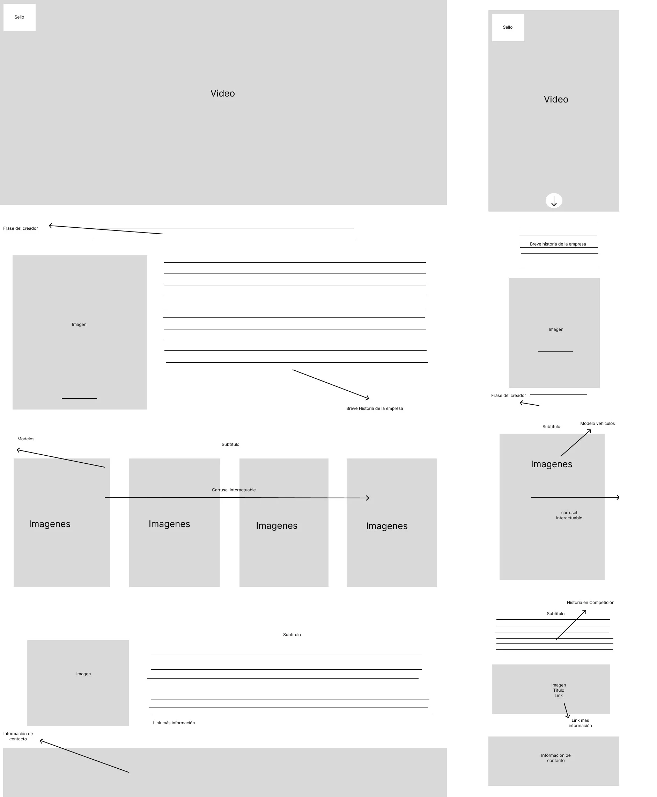
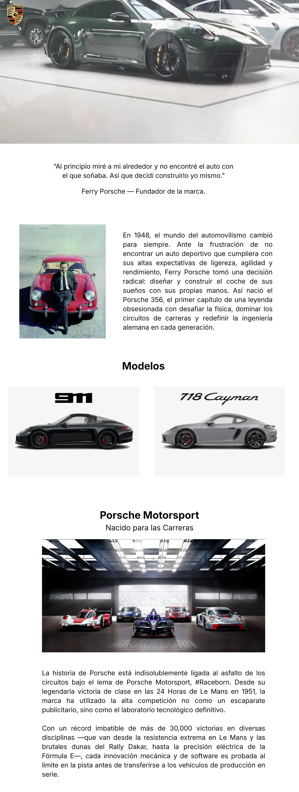

# **ÍNDICE**
* [1. Blog Vehículos Porsche](#1-blog-vehículos-porsche)
* [2. Realización del Proyecto](#2-realización-del-proyecto)
* [3. Tecnologías Empleadas](#3-tecnologías-empleadas)
* [4. Autores](#4-autores)

***
  

    
  

  
***

## 1. Blog Vehículos Porsche
Esta página web es un blog centrado en información de los vehículos Porsche, enfocandose en su historia, el autor, modelos importantes, y la linea Motorsport.

El objetivo de la realización de este blog es el obtener conocimientos tanto en HTML como CSS, específicamente con el manejo del "responsive desing" mediante la práctica "Mobile First".

***
## 2. Realización del Proyecto
### 2.1 Wireframe:
En este apartado, se realizó un esquema visual de la estructura principal del blog, definiendo la mayoría de secciones.

    

### 2.2 Mockup:
Luego de realizar el wireframe, se procedió con la realización del diseño visual base del blog en versión pc, sin incluir algunas secciones.

    

***
## 3. Tecnologías Empleadas

- [HTML:](https://developer.mozilla.org/es/docs/Web/HTML) Usada para construir la estructura y el contenido del blog.

- [CSS:](https://developer.mozilla.org/es/docs/Web/CSS) Usada para definir el estilo visual del blog.

- [Figma:](https://www.figma.com) Plataforma para crear las estructuras del prototipo (Wireframe, mockup).

- [Canvas:](https://www.canva.com) Plataforma para crear el diseño del blog.

***
## 4. Autores
- [Esteban Castro](https://github.com/estebancascardev)

- [Nicolas Mayorga](https://github.com/nicomayorga02-collab)
